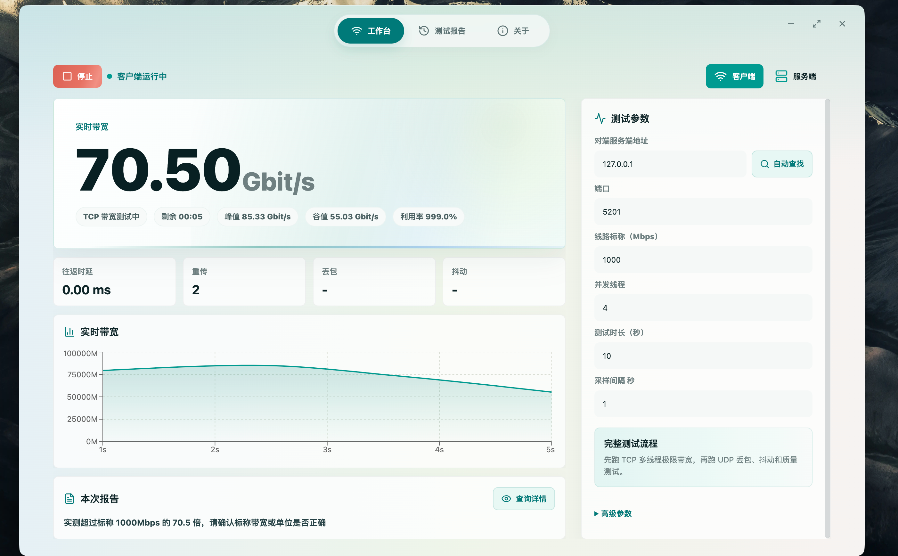
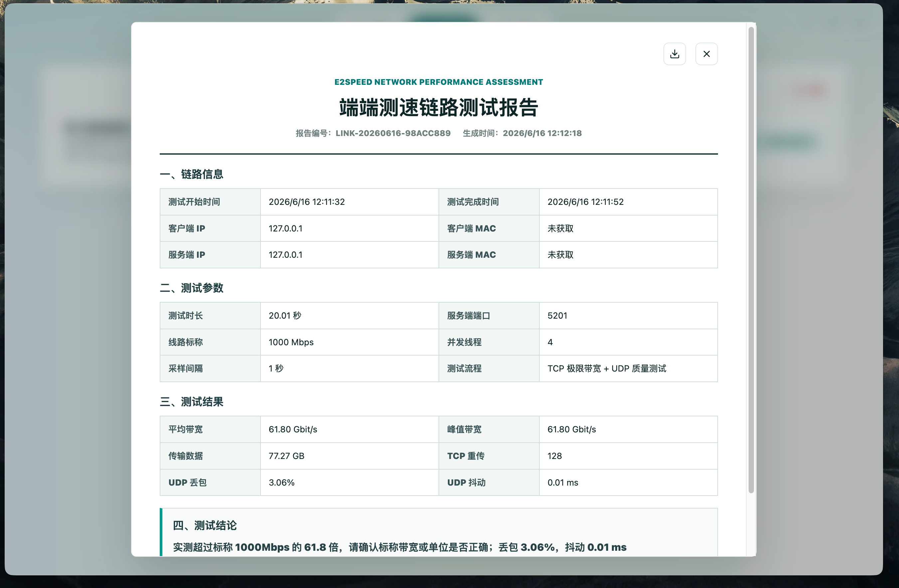

# E2Speed

E2Speed 是一个面向桌面的网络测速工具，用图形界面封装 iperf3，让点对点带宽、抖动、丢包、重传等测试不用再去记复杂命令，开箱即用。

它适合用来做局域网、专线、Wi-Fi、有线链路和服务器之间的吞吐测试。客户端和服务端都可以在界面里启动，测试过程会实时显示曲线、日志和摘要，并保留可复现的 iperf3 命令。

## 界面预览

测试页面：



测试报告：



## 基于什么改造

E2Speed 基于 iperf3 改造而来，但没有重写 iperf3 的测速逻辑。应用本身使用 Electron、React 和 TypeScript 开发，底层通过 Electron 主进程调用内置或用户指定的 `iperf3` 可执行文件。

项目内带有 `iperf-3.21` 源码副本，方便在不同平台重新构建运行时二进制。当前的桌面端主要是在 iperf3 之上补了一层更适合日常测试和报告整理的交互界面。

## 主要特点

- 图形化配置客户端和服务端，覆盖常用 TCP、UDP、上传、下载、双向、并发、端口、时长、带宽等参数。
- 一次测试中自动组合 TCP 极限带宽和 UDP 质量测试，适合快速判断链路是否达标。
- 实时展示速率曲线、抖动、丢包、重传、RTT 等关键指标。
- 服务端模式支持连接日志、客户端质量指标回传和局域网发现。
- 每次测试会生成历史记录，保存配置、摘要和原始 JSON，便于回看和复测。
- 界面会显示等价 iperf3 命令，方便复制到命令行排查问题。
- 支持导出测试报告 PDF。
- 可以使用项目内置 iperf3，也可以在设置中选择系统里的 iperf3。

## 支持系统

应用按跨平台桌面工具设计，目标支持：

- macOS
- Windows
- Linux

当前仓库已经放入 macOS 运行时二进制，路径为 `resources/bin/darwin/`。Windows 和 Linux 的目录已经预留，可以后续放入对应平台的 `iperf3` 可执行文件。

## 项目结构

```text
.
├── desktop/                 Electron + React 桌面应用
├── docs/                    产品和架构说明
├── resources/bin/           各平台 iperf3 运行时二进制
└── vendor/iperf-3.21/       iperf3 源码副本
```

## 开发

先安装桌面端依赖：

```sh
cd desktop
npm install
```

启动开发环境：

```sh
npm run dev
```

开发服务默认运行在：

```text
http://127.0.0.1:5173/
```

## 构建

类型检查：

```sh
cd desktop
npm run typecheck
```

构建前端和主进程：

```sh
npm run build
```

打包当前平台安装包：

```sh
npm run dist
```

按平台打包：

```sh
npm run dist:mac
npm run dist:win
```
